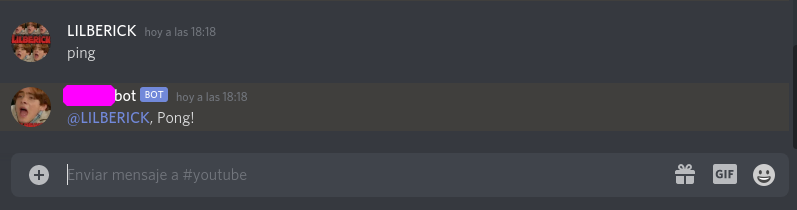

# [DISCORD.JS](https://discord.js.org/#/)

# Instalación
```
$ npm install discord.js
```
# Hola mundo: (input=ping)(output=pong)
1. `index.js`

	```js
	const Discord = require('discord.js');
	const client = new Discord.Client();
	client.on('ready', () => {
	  console.log(`Logged in as ${client.user.tag}!`);
	});
	client.on('message', msg => {
	  if (msg.content === 'ping') {
	    msg.reply('Pong!');
	  }
	});
	client.login('token'); //Coloca tu token del bot de discord que has creado
	```  
2. inicializar
	```
	$ npm init
	$ node index.js
	```
3. Ya podemos usar el bot en discord  
	  
