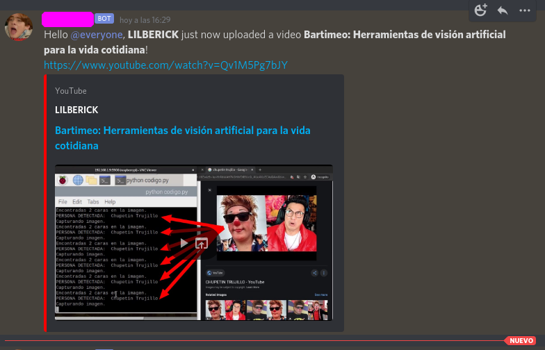

# YOUTUBE NOTIFICATION
Notifica en un canal de discord específico cuando un nuevo video de youtube se ha subido.  


# Instalación
* [**discord.js**]()
	```
	$ npm install discord.js 
	```
* [**quick.db**]()
	```
	$ npm install quick.db
	```
* [**rss-parser**]()
	```
	$ npm install rss-parser
	```

# config.js
```js
  module.exports = {
    token: "YOUR_DISCORD_BOT_TOKEN", // discord bot token
    channel: "DISCORD_CHANNEL_ID", // channel id of a channel to send message
    messageTemplate: "Hola @everyone, **{author}** justo ahora ha subido un nuevo video **{title}**!\n{url}", // message to send on discord
    channel_id: "YOUTUBE_CHANNEL_ID", // youtube channel id
    watchInterval:  5000 // Check every 5 seconds
  };
```
